  

# 🚨 Awesome Emergency Operations Center (EOC)

  
  
  
  
  
  

## 🌐 Overview & Ecosystem

A curated list of top **Emergency Operations Center (EOC) software**, **Incident Command Systems (ICS)**, **Virtual EOCs**, **Disaster Management Platforms**, and **Crisis Response Tools**. Designed for emergency managers, public safety officers, enterprise resilience teams, and humanitarian responders.

Last updated: **September 2026**

---

## 📑 Table of Contents

- [📊 SaaS & Commercial EOC Platforms](#-saas--commercial-eoc-platforms)
- [🔓 Open-Source GitHub Projects](#-open-source-github-projects)
- [🤝 How to Contribute](#-how-to-contribute)
- [❤️ Support & Sponsorship](#%EF%B8%8F-support--sponsorship)
- [⚠️ Disclaimer](#%EF%B8%8F-disclaimer)
- [📈 Star History](#-star-history)

---

## 📊 SaaS & Commercial EOC Platforms

### 💡 Sector Market Size & Market Concentration Dynamics
> 📊 **Estimated Sector Market Size**: The global Emergency Management and Incident Response Software Market is valued at **$12.5 Billion – $15.5 Billion** (with projections reaching ~$22+ Billion by 2030 at a ~7.5% CAGR).  
> 🏛️ **Market Structure**: The sector is **moderately to highly fragmented** with specialized regional leaders, though critical mass is consolidating around major PE-backed platforms (e.g., Thoma Bravo acquiring Everbridge for $1.8B, Five Arrows backing Juvare/WebEOC). High compliance standards (NIMS/ICS), government procurement hurdles, and multi-agency interoperability requirements prevent a single "winner-take-all" outcome, allowing specialized SaaS vendors to thrive alongside category giants.

### 🏢 SaaS Products Matrix (Sorted by Estimated Company Size / Valuation Descending)

| 🏢 Platform | 📝 Description | 💰 Pricing | 🎁 Free Tier / Trial Limits | 📈 Estimated Company Size / Valuation |
| :--- | :--- | :--- | :--- | :--- |
| **[Everbridge](https://www.everbridge.com/)** | Critical event management platform with mass notification, risk intelligence, and EOC coordination workflows. | Mass Notification starts ~$5,000/yr; mid-sized $25,000–$75,000/yr; enterprise CEM $100,000+/yr | No full software free trial; 14-day free Risk Intelligence sample trial available | **$1.8 Billion Valuation** (~$450M Annual Revenue, Acquired by Thoma Bravo) |
| **[Crisis24](https://www.crisis24.com/)** | Global risk intelligence, crisis management, and emergency response operational software. | Custom enterprise subscription (full enterprise packages start ~$100,000+/yr) | No free software trial; sample intelligence reports and consultative demos available | **~$250M – $500M Revenue** (GardaWorld Crisis & Risk Division) |
| **[WebEOC by Juvare](https://www.juvare.com/)** | De-facto public safety and EOC standard software for incident tracking, resource status, and operational reporting. | Starts ~$8,000–$20,000/yr for small modules; enterprise/statewide deployments $20,000–$100,000+/yr | No free tier or trial; free on-demand training courses offered via Juvare Training Center | **~$100M – $250M Revenue / PE Backed** (Five Arrows Private Equity) |
| **[Fusion Risk Management](https://www.fusionrm.com/)** | Enterprise business continuity, operational resilience, and crisis management software on Salesforce. | Custom enterprise quotes (~$93,000/yr avg, range $7,000–$149,000+/yr + Salesforce licensing) | No free tier or self-service trial; direct sales demo required | **~$50M – $100M Revenue** (~$93k Average Annual Contract) |
| **[Veoci](https://www.veoci.com/)** | Cloud-based virtual EOC, incident management, and task-tracking suite for government, healthcare, and higher-ed. | Custom enterprise quotes (tailored by organization headcount and module scope) | No free tier; live demonstration available upon request | **~$20M – $50M Revenue** (Private, High Growth) |
| **[Noggin](https://www.noggin.io/)** | Integrated risk management, crisis response, and operational continuity software platform. | Custom enterprise subscription (deployments typically start at ~A$75,000/yr) | No free tier or public trial; custom product demos available upon request | **~$20M – $50M Revenue** (Global Enterprise Presence) |
| **[Preparis](https://www.preparis.com/)** | Business continuity, emergency notification, and incident recovery platform by Mitratech. | Custom quote-based pricing depending on module scope and user count | No free tier or self-service trial; free customized demo available on request | **~$15M – $40M Revenue** (Mitratech Business Unit) |
| **[DisasterLAN (DLAN)](https://www.disasterlan.com/)** | EOC software by Buffalo Computer Graphics focusing on mapping, incident management, and multi-agency coordination. | Custom quotes via GSA schedule/BCG packages (no per-user fees for extra personnel during response) | Evaluation free trial available upon direct contact and request to vendor | **~$10M – $25M Revenue** (Buffalo Computer Graphics) |
| **[NIMSsoft](https://www.nimssoft.com/)** | NIMS and Incident Command System (ICS) forms automation and situational awareness tools. | Custom module / site licensing | No public free trial; contact vendor directly | **~$1M – $5M Revenue** (Niche ICS Specialist) |

---

## 🔓 Open-Source GitHub Projects

Below is a curated list of active open-source crisis mapping, disaster management, emergency alerting, and situational awareness repositories.

### 🌟 Open-Source Repositories (Sorted by Star Count Descending)

| 📦 Repository / Project | 🏷️ Description | ⭐️ Stars | 🔗 Quick Links |
| :--- | :--- | :--- | :--- |
| **[Ushahidi Platform](https://github.com/ushahidi/platform)** | Open-source crisis mapping, crowdsourced incident reporting, and data visualization engine used globally during disasters. |  | [GitHub Repo](https://github.com/ushahidi/platform) • [Docs](https://docs.ushahidi.com) |
| **[Sahana Eden](https://github.com/sahana/eden)** | Leading open-source humanitarian logistics, incident management, shelter tracking, and disaster response platform. |  | [GitHub Repo](https://github.com/sahana/eden) • [Website](https://sahanafoundation.org) |
| **[SIGIMERA](https://github.com/sigimera/sigimera-app)** | Open-source crisis early warning and disaster information management platform. |  | [GitHub Repo](https://github.com/sigimera/sigimera-app) |
| **[OpenStreetMap Tasking Manager](https://github.com/HOTOSM/tasking-manager)** | Humanitarian OpenStreetMap Team (HOT) tool for collaborative disaster mapping and satellite imagery coordination. |  | [GitHub Repo](https://github.com/HOTOSM/tasking-manager) • [HOT OSM](https://www.hotosm.org) |
| **[Sahana SAMBRO](https://github.com/sahana/SAMBRO)** | Multi-agency emergency alerting and messaging broker implementing the Common Alerting Protocol (CAP). |  | [GitHub Repo](https://github.com/sahana/SAMBRO) |
| **[InaSAFE](https://github.com/inasafe/inasafe)** | Free and open-source software that produces realistic natural hazard impact scenarios for emergency planning. |  | [GitHub Repo](https://github.com/inasafe/inasafe) • [Website](http://inasafe.org) |
| **[Open Disaster Management Playbooks](https://github.com/sahana/eden/wiki)** | Open deployment playbooks, NIMS/ICS form templates, and operational guides for self-hosted EOC dashboards. |  | [Wiki & Playbooks](https://github.com/sahana/eden/wiki) |

---

## 🤝 How to Contribute

Contributions are welcome! Please follow these simple guidelines:

1. 🍴 **Fork** the repository.
2. 📝 **Add/Update** entries in `README.md` keeping the Markdown tabular formatting consistent.
3. 🔍 **Provide Factual Details**: Include pricing estimates, free trial terms, company size, or open-source star badges.
4. 🚀 **Submit a Pull Request** with a clear explanation of your additions.

---

## ❤️ Support & Sponsorship

If you find this curated Emergency Operations Center ecosystem list useful for your research, agency, or deployment, please consider supporting the project!

- ⭐️ **Star** this repository on GitHub to increase its visibility.
- 🔄 **Share** it with emergency management professionals, public safety engineers, and disaster response teams.
- ☕ **Buy Me a Coffee**: Support ongoing open-source maintenance via the [GitHub Sponsor Dashboard](https://github.com/sponsors/ishandutta2007).

---

## ⚠️ Disclaimer

- This list is **community-curated** for educational, research, and informational purposes only. Inclusion does not constitute an endorsement.
- Emergency operations, disaster response, and life-safety systems are mission-critical. Open-source deployments require thorough vetting, backup connectivity, and operational training.

---

## 📈 Star History

